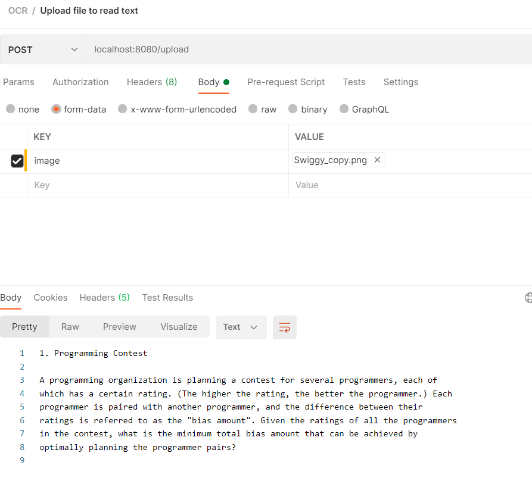

# Read Data from PDF / Image Using Tessaract

## Aim

To read the details from a scanned copy of manually filled form with a standard template.

## User Journey

1. Upload a scanned copy of the form
2. Review the pre-filled digital details from the system.
    a. Correct the details if needed.
3. Submit the data to save.

## Getting the code started.

The code is set up to read english language from the image uploaded. 

1. Clone the project.
2. Download the [eng.traineddata](https://github.com/tesseract-ocr/tessdata/blob/main/eng.traineddata) or any other language you want to from [here](https://github.com/tesseract-ocr/tessdata).
3. Place the eng.traineddata to your %JAVA_HOME\tessdata\ [Eg. C:\Program Files\Java\jdk-13.0.1\bin\tessdata] directory.
4. Open the project in intellij or sts and run the project.
5. Hit http:\\localhost:8080\upload using the image key and value as the file as shown below:

6. You should see the extracted text as response.

## Technical Details

1. Endpoint to upload the form.
2. Create a ML Model to process the prefilled form.
    a. Create a data model that accepts all the major form components like
        i. Text Box
        ii. Radio Button/Check Box
    b. Train the data model.
    c. Test the data model.
3. Display the processed information to the user to review.
    a. Allow user to edit option
4. Save the data when user clicks on submit.

## Reference Links

* https://github.com/tesseract-ocr/langdata
* https://github.com/tesseract-ocr/tesseract
* https://stackoverflow.com/questions/44619077/pytesseract-ocr-multiple-config-options
* https://pypi.org/project/pytesseract/
* https://github.com/bytedeco/javacv
* https://github.com/bytedeco/javacpp-presets/tree/master/tesseract
* https://github.com/tesseract-ocr/tessdata